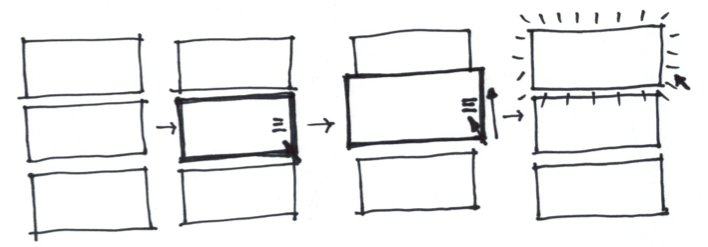

#Custom Layout Builder - User Story

##Add / Remove Component
User can add modules to the page and remove modules from the page.
Currently no set limit on how many modules can be shown in the page, user can
insert multiple modules with different parameters to show different data using the
same modules.
A Preview / Shaded image will be use to represent the content of the real module,
no real data is being fetch in this edit layout mode.

##Drag / Drop Layout
User can drag and drop module location by dragging the panel on the handler.
Currently user are constrained to 2X grid, Ideally the layout can conform to
Mobile and Desktop View.

##Configure Component
User can click on the settings button on each panel and configure the content
parameters, size etc.
When user click on the config icon ( a cog ? ) it will turn the component panel
and show the panel configuration interface.

##Drag to Resize
User can drag the component border to resize the width of the component.
Currently user are constrained to 2X grid, Ideally the layout can conform to
Mobile and Desktop View.

##Show 3rd Party Component
User can insert a component to show their custom build component by specifying
their component URL, height, width and variables that we going to pass to the
components ( e.g.: `affiliate_id`, `affiliate_user_id` and `network_id` ).
3rd Party Component need to live in the sandbox environment in the page,
preventing 3rd party script to interfere with HO code.

